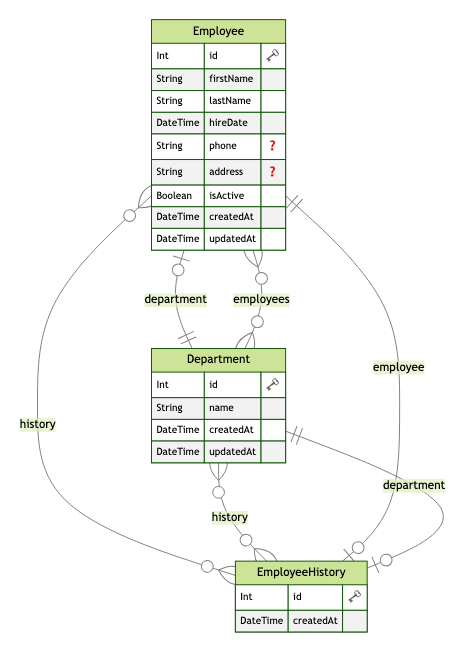

# fullstack-assessment

Project Overview:

This project is a Single-Page Application (SPA) built using React and TypeScript, accompanied by an API constructed with Fastify and Prisma, adhering to the Controller-Service-Repository (CSR) architecture.

Front-end Technologies:

* React Router DOM for route management and code splitting to reduce bundle size
* User Context API for managing global state, such as departments
* React Hook Form for form control, paired with Zod for validation
* Shadcn for front-end component management
* Tanstack Query for efficient HTTP request management
* Vitest for unit testing

Back-end Technologies:

* Fastify for creating an HTTPS server and utilizing Fastly logger
* ZOD for schema validation at the routes layer
* Prisma for database migrations and iterations
* Unit tests at the Service layer for critical business logic
* Postgresql as main Databse
* Docker Compose for running the database image with a volume for data persistence
*




### Getting started

First, you need to set up the database provided by the `docker-compose.yml` file in the root of the repository.
To do this, run the following command to start a PostgreSQL Docker image in detached mode:

```console
docker-compose up -d
```

After setting up the database, you need to run the db migration to create the initial structure.

```console
npx prisma migrate dev
```
---
### API Setup and Run

To set up the API, navigate to the `api` folder and run the following command to install all dependencies:
```console
npm install
```

Once the dependencies are installed, you can start the API project locally using the following command:
```console
npm run dev
```
---
### Front-end Setup and Run
To set up the Front-end, navigate to the `front-end` folder and run the following command to install all dependencies:
```console
npm install
```

Once the dependencies are installed, you can start the front-end project locally using the following command:
```console
npm run dev
````

